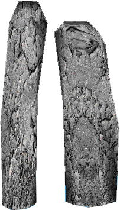
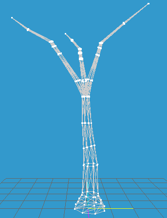

**Screen Shots**

**Materials**

-   MAP Editor Program (in C\# .NET)

-   3D Models

    -   3ds Models

    -   Md2 Models

-   3D Sound (Using FMOD)

    -   FMOD Sample

    -   FMOD Stream

**MAP Editor**

The map editor helps us to position different kind of objects (static or
dynamic) in any part of the map.

The coordinates, types, and sizes of these objects and maps are saved into a
file.

Using Those Combo Boxes and Buttons we can add new objects into Our Map.

**Header of The Map file**

| Number of Object | Map Width | Map Height | Map Fog | Floor Texture No |
|------------------|-----------|------------|---------|------------------|
| 3 Chars          | 4 Chars   | 4 Chars    | 1 Char  | 1 Char           |

**For the Each Object**

| X       | Y       | Radius | Model Type | Model No | Health  |
|---------|---------|--------|------------|----------|---------|
| 4 Chars | 4 Chars | 1 Char | 1 Char     | 2 Chars  | 3 Chars |

The coordinates, types, and sizes of these objects and maps are saved into a
file according to those formats.

**3D Models**

3ds Models (Autodesk 3D Studio)

-   This 3D model format developed by Autodesk

-   3ds Models for the static objects

Md2 Models (Quake II)

-   This format used in Quake II game

-   But md2 is contains animations

**3ds Models (Autodesk 3D Studio)**

I choose MilkShape3D program, because creation of this models can be edit and
create easily in MilkShape3D program

**Md2 Models (Quake II)**

>   This File Format Created for the Quake II.

-   I used instant models in my game.

-   All the models have animations (Run, Die, Stand … etc.)

**3D Sound (Using FMOD)**

>   FMOD : This library can control all the multimedia tools in our computer.

-   Playing WAV, MP3

-   Recording Voice

-   Playing CD-ROM

**Libraries**

**1) FMOD Stream:**

This is a class that I wrote for 3D voice.

This file use WAV sound format for the 3D sounds.

**2) FMOD Sample**

This is class that I used for playing MP3 or WAV sound format.

**Main.cpp & Main.h**

This part is the main part of the program, it calls all other libraries and it
creates all variables which are necessary for the program.

**Bmp.h**

With this library we can add the files which are related to BMP to our game.

**Character.h**

The aim of this file is to print the objects visual to screen which are read
from MAP file. Also the aim of this library is if the object isn’t static, we
must be moved to object true through our game hero. When object come enough
nearly, object hit our hero for reducing his energy.This library also helps us
to have a 3D voice of our object.

**Model md2**

In this library, with model md2 class provides to add files, I mean animations
which are related to md2 file to our game.

**Model 3ds**

In this library, with functions provide to add files which are related to 3D
file format to our game.

**Camera**

In this file, functions provide to our camera to move in 3D place. Also by
learning our hero’s angle, it changes our hero’s angle.
